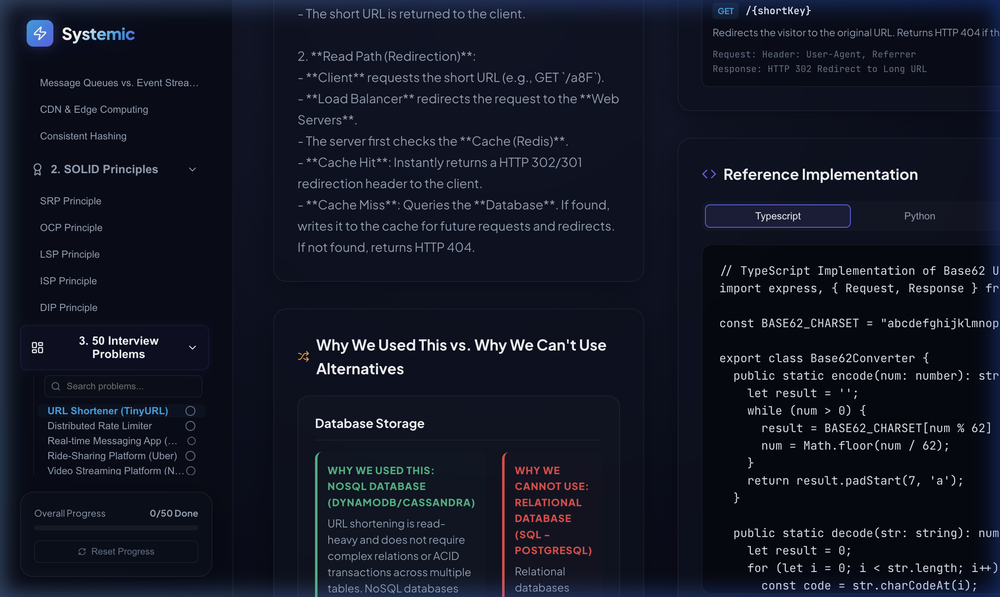
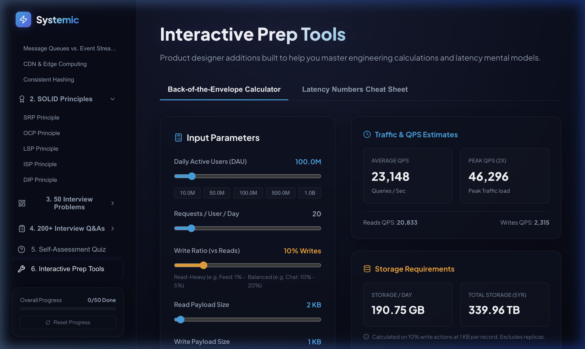
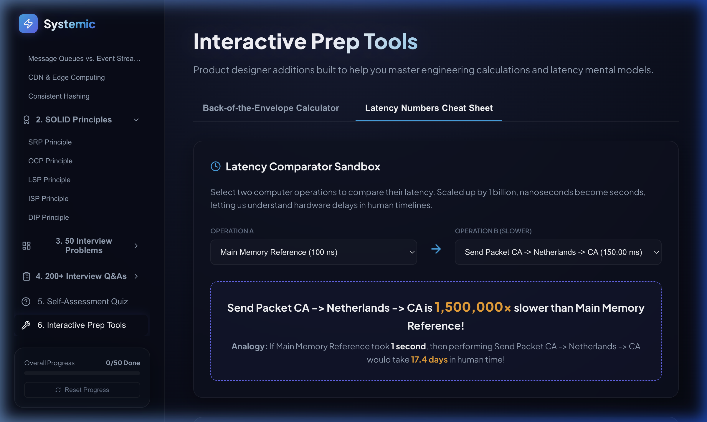
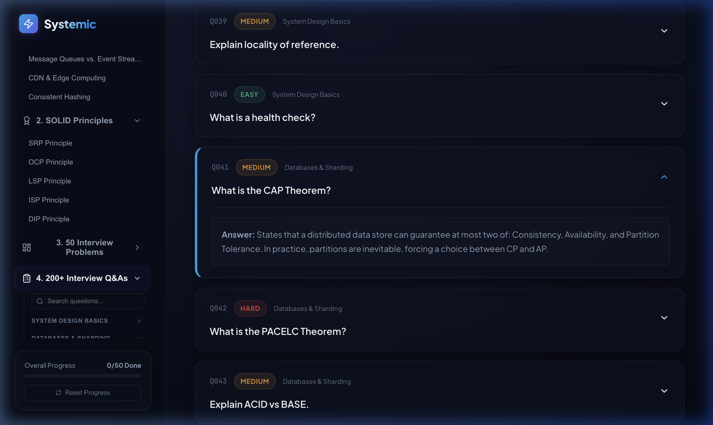
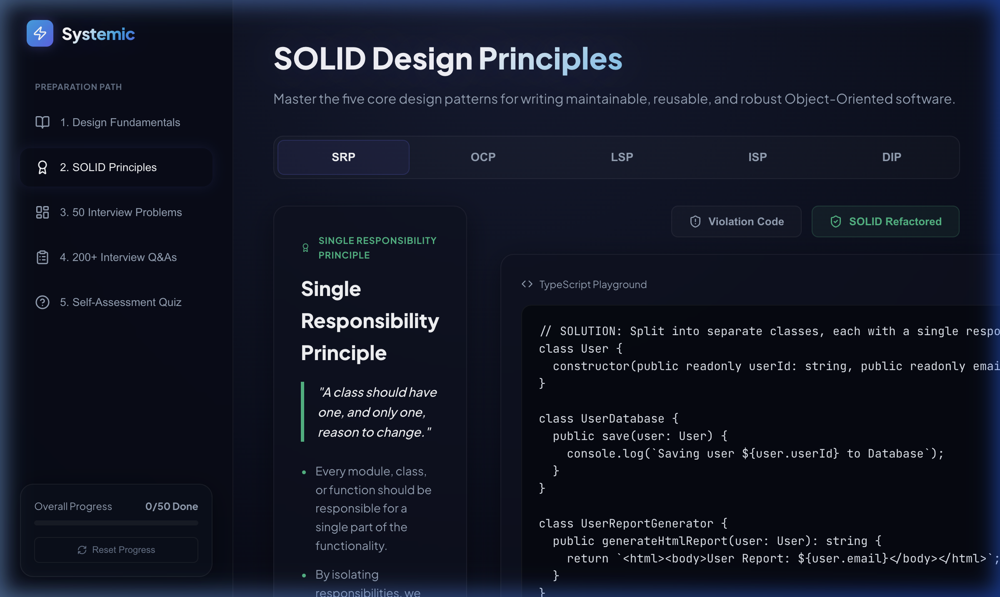
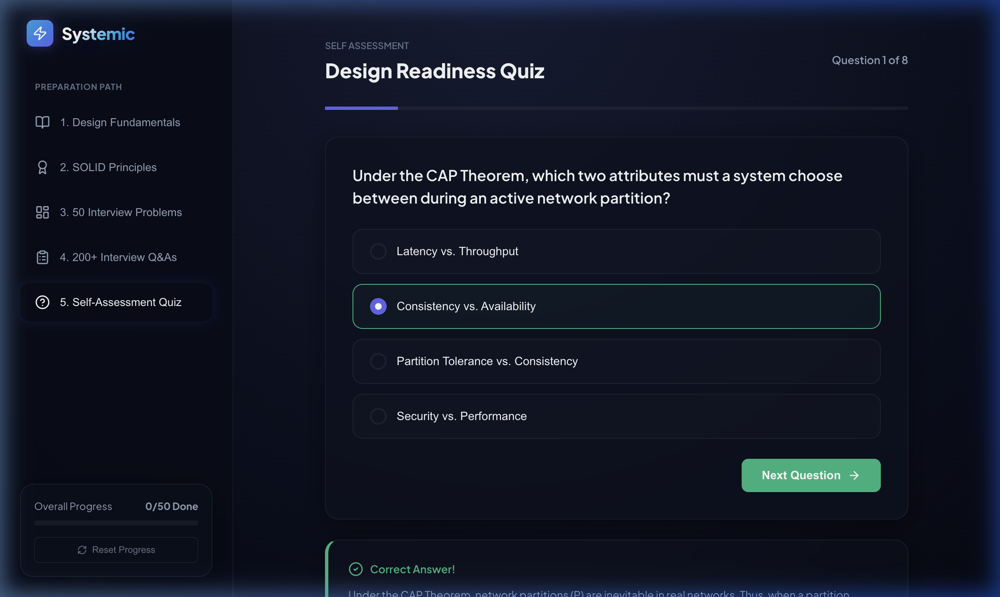

# 🚀 Systemic — Interactive System Design & SOLID Prep Platform

Systemic is a premium, feature-rich interactive web application designed to serve as a **single source of preparation** for System Design and LLD (Low-Level Design) interviews. It provides a structured learning roadmap, detailed conceptual breakdowns, interactive diagrams, and product design tools.

---

## 🖥️ Platform Demonstration

Below is a live walkthrough demonstrating the interactive sidebar, problem-solving flows, and the real-time capacity calculator:


---

## ✨ Key Features

### 1. Progressive Learning Path (collapsible Sidebar Tree)
- **Design Fundamentals (Basics)**: High-detail foundation building blocks (Scaling, Load Balancers, Caching, Databases, Message Queues, CDN, Consistent Hashing).
- **SOLID Principles**: OOP design foundations with side-by-side Violation vs. Refactored code panels in TypeScript.
- **50 Interview Problems**: Tracker board containing the top 50 trending questions, detailing Write/Read paths, API schemas, and code in 5 languages.
- **200+ Trending Q&A Deck**: Paginated, searchable question bank grouped by category (System Design Basics, Databases, Caching & Networking, Rate Limiters, SOLID).
- **Self-Assessment Quiz**: An interactive MCQ testing engine with visual score meters and in-depth explanation logs.

### 2. "Why vs. Why NOT" Design Trade-offs
In every design problem (e.g., URL Shortener, Rate Limiter, Chat Service), Systemic provides side-by-side comparison tables explaining why a particular design decision was chosen and why standard alternatives fail (the typical "hard-positive" questions asked in Google/Meta loops):
- *e.g., why Token Bucket vs. why NOT Sliding Window Log?*
- *e.g., why Base62 counter vs. why NOT MD5 hashing?*

### 3. Back-of-the-Envelope Capacity Estimator
An interactive calculator where candidates can input system parameters (e.g. DAU, request frequency, write ratio, payload size, retention period) and instantly calculate:
- **Read & Write QPS** (Average & Peak).
- **Storage Sizing** (Daily, Yearly, and total retention).
- **Network Bandwidth** (Upload/Download in Mbps/Gbps).
- **Cache Memory Sizing** (using Pareto 80/20 rule).

### 4. Latency Numbers Comparator
An interactive grid of Jeff Dean's famous numbers every programmer should know, complete with a comparison sandbox. Scaled up by 1 billion, it provides intuitive human analogies (e.g., a disk seek of 10ms becomes 116 days if a memory lookup is 1 second).

---

## 📸 Application Screenshots

### Premium Main Dashboard
A clean glassmorphic UI tracking progress across all 50 system design problems:


### Why vs. Why NOT Alternatives Analysis
Deep dive analysis highlighting why alternative systems fail under write scale and high concurrency:


### Interactive Back-of-the-Envelope Calculator
Dynamically compute scale metrics for system design interviews:


### Latency Comparator Sandbox
Interactive latency comparison with relative scaling and human-time analogies:


### Collapsible 200+ Q&A Bank
Search, filter, and expand categories directly from the nested sidebar tree:


### SOLID Code Comparisons
Before/after refactoring toggles illustrating design violations:


### Self-Assessment Quiz
Validate distributed systems knowledge:


---

## 🛠️ Technology Stack
- **Framework**: React + TypeScript + Vite
- **Styling**: Vanilla CSS (Custom Glassmorphism tokens, CSS Variables, and SVG animations)
- **Icons**: Lucide React
- **State Management**: Persistence enabled via LocalStorage (`sys_design_progress`)

---

## 🚀 Local Installation

Get the application running locally in under a minute:

1. **Clone the repository**:
   ```bash
   git clone git@github.com:yashdhingra0/system-design.git
   cd system-design
   ```

2. **Install dependencies**:
   ```bash
   npm install
   ```

3. **Start the development server**:
   ```bash
   npm run dev
   ```

4. Open `http://localhost:5173/` in your browser.
