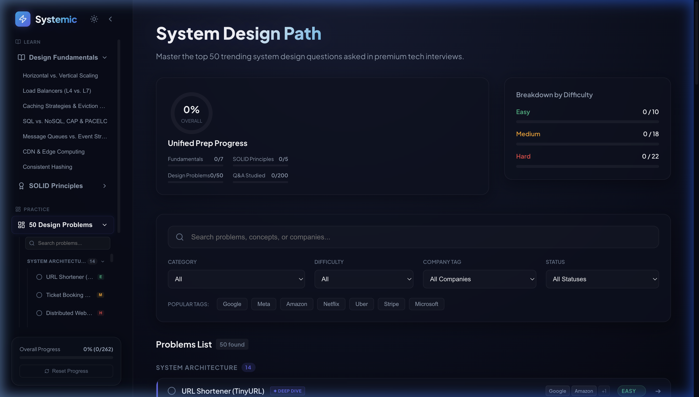
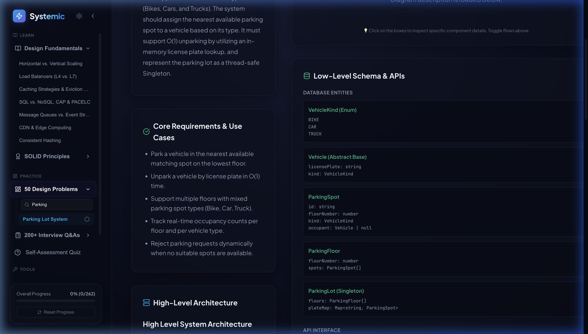
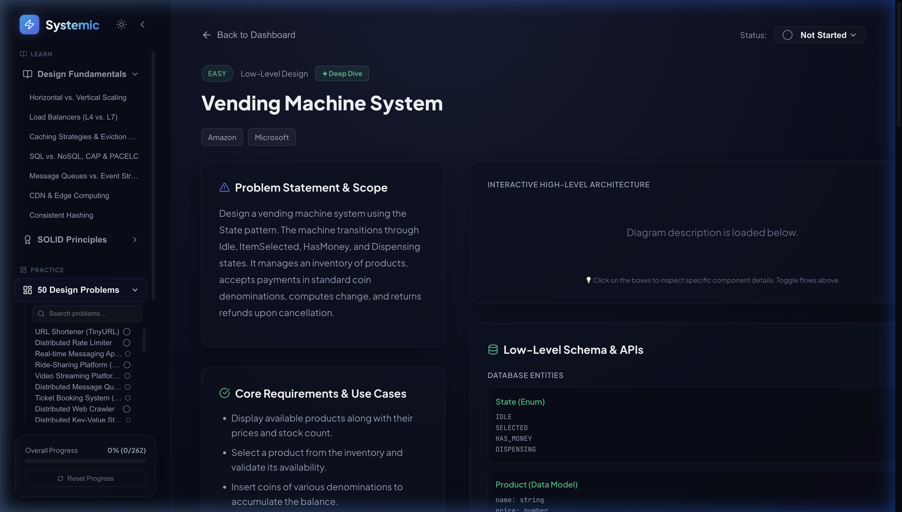
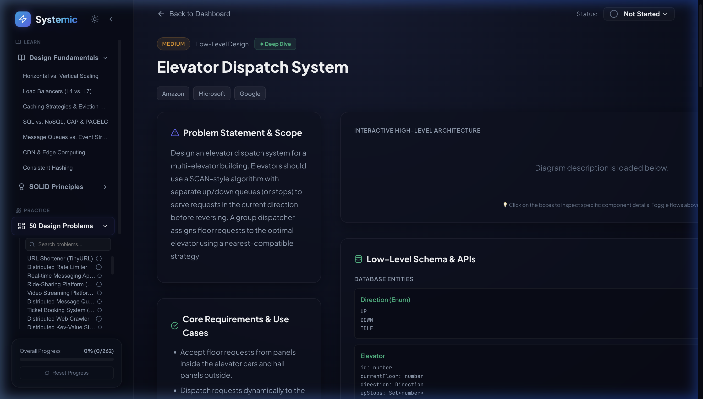

# 🚀 Systemic — Interactive System Design & SOLID Prep Platform

Systemic is a premium, feature-rich interactive web application designed to serve as a **single source of preparation** for System Design and LLD (Low-Level Design) interviews. It provides a structured learning roadmap, detailed conceptual breakdowns, interactive diagrams, and product design tools.

---

## 🖥️ Platform Demonstration

Below is a live walkthrough demonstrating the interactive sidebar category tree, high-density problems list, detailed LLD views, and the capacity calculator:


---

## ✨ Key Features

### 1. Collapsible Categorized Sidebar & Navigation Tree
- **Desktop Sidebar**: Toggle between a fully expanded details view (280px) and a collapsed icon-only navigation bar (76px) to maximize your workspace.
- **Categorized Problem Tree**: Problems are neatly grouped by engineering domains (e.g. *System Architecture*, *Distributed Systems*, *Low-Level Design*). Toggle headers collapse/expand categories dynamically.
- **Inline Status & Difficulty Tags**: Track completion status directly from the sidebar checklist. Each item highlights its difficulty (`E` for Easy, `M` for Medium, `H` for Hard) in color-coded pills.
- **Mobile Responsive Drawer**: Sliding overlay drawer on mobile viewports triggered by a hamburger header.

### 2. High-Density Problems Catalog
- **Categorized Dashboard Catalog**: Problems list is grouped dynamically by category, eliminating layout congestion.
- **Row-Based Problem Items**: Shows name, completion checkbox, company tags slice, difficulty tag, and `✦ Deep Dive` vs `📝 Summary` badge in a neat 50px row.
- **Unified Progress Tracking**: Displays a centralized prep progress meter tracking Fundamentals studied, SOLID principles checked, Problems completed, and Q&As reviewed.

### 3. Fleshed-Out Low-Level Design (LLD) Problems
Fully detailed, production-ready interactive OOP implementations for highly asked LLD questions:
- **Parking Lot System**: Supports multiple vehicle kinds, pre-bucketed free lists for O(1) spot allocation, fine-grained locking, O(1) unpark plate map, and Singleton pattern.
- **Vending Machine System**: State design pattern controller executing Idle, Selected, HasMoney, and Dispensing transitions.
- **Elevator Dispatch System**: Group controller utilizing the SCAN scheduling algorithm with separate up/down sets, and nearest-compatible dispatcher scheduling.
- **Multi-Language Solutions**: Every detailed problem includes complete runnable models in **TypeScript**, **Python**, **Java**, **Go**, and **C++**.

### 4. Last-Minute Revision Notes
High-impact cheatsheets summarizing core content:
- **2-Hour Checklist**: Key mental models and checklists before walking into the interview loop.
- **Scale Rules of Thumb**: App server throughput thresholds, database limits, and QPS estimations quick charts.
- **Key Trade-offs Cheat Sheet**: Relational vs. NoSQL, WebSockets vs. SSE, and Pull vs. Push.

### 5. Interactive Prep Sandbox
- **FAANG Scorecard**: A self-assessment tool based on actual FAANG grading rubrics. Adjust sliders to evaluate your design and communication performance to check your hiring verdict.
- **Interactive Practice Checklist**: A structured 45-minute whiteboard simulator. Start/pause the built-in countdown timer and check off required design phases (Requirements, Estimations, API, ERD, HLD, LLD, Tradeoffs).
- **Systems Glossary**: A searchable distributed systems dictionary with definitions for Gossip Protocol, Split-Brain, and Quorums.
- **Company Study Paths**: Specific problem paths tracked for Google, Meta, Uber, Netflix, and Amazon.

### 6. Back-of-the-Envelope Capacity Estimator
An interactive calculator where candidates can input system parameters (e.g. DAU, request frequency, write ratio, payload size, retention period) and instantly calculate:
- **Read & Write QPS** (Average & Peak).
- **Storage Sizing** (Daily, Yearly, and total retention).
- **Network Bandwidth** (Upload/Download in Mbps/Gbps).
- **Cache Memory Sizing** (using Pareto 80/20 rule).

### 7. Latency Numbers Comparator & Logarithmic Timeline
An interactive grid of Jeff Dean's famous numbers every programmer should know, complete with:
- **Logarithmic Timeline Bar**: Visually see operation speeds (L1 cache vs. Disk seek) on a colored logarithmic bar chart.
- **Comparison Sandbox**: Select two operations to compute relative scaling and human-time analogies (e.g. disk seek is 20M times slower than L1 cache, equivalent to 231 days if L1 lookup was 1 second).

---

## 📸 Application Screenshots

### Premium Main Dashboard
A clean glassmorphic UI tracking grouped progress across all 50 system design problems:


### Grouped Problems Sidebar
Sleek collapsible categories list with difficulty and completion state indicators:


### Parking Lot LLD Detail View
Complete class layouts, APIs, and multi-language codes:


### Vending Machine LLD State View
Detailed FSM transitions and design patterns:


### Elevator Dispatch LLD SCAN View
Optimal elevator selection strategy and SCAN step simulations:


### Last-Minute Revision Notes
Quickly review and check off core conceptual summaries:


### Whiteboard Timer & Practice Checklist
Time-slice your mock practice sessions:


### FAANG Grading Scorecard
Self-evaluate your design and communication loop:


---

## 🛠️ Technology Stack
- **Framework**: React + TypeScript + Vite
- **Styling**: Vanilla CSS (Custom Glassmorphism tokens, CSS Variables, and SVG animations)
- **Icons**: Lucide React
- **State Management**: Persistence enabled via LocalStorage (`sys_design_progress`)

---

## 🚀 Local Installation

Get the application running locally in under a minute:

1. **Clone the repository**:
   ```bash
   git clone git@github.com:yashdhingra0/system-design.git
   cd system-design
   ```

2. **Install dependencies**:
   ```bash
   npm install
   ```

3. **Start the development server**:
   ```bash
   npm run dev
   ```

4. Open `http://localhost:5173/` in your browser.
