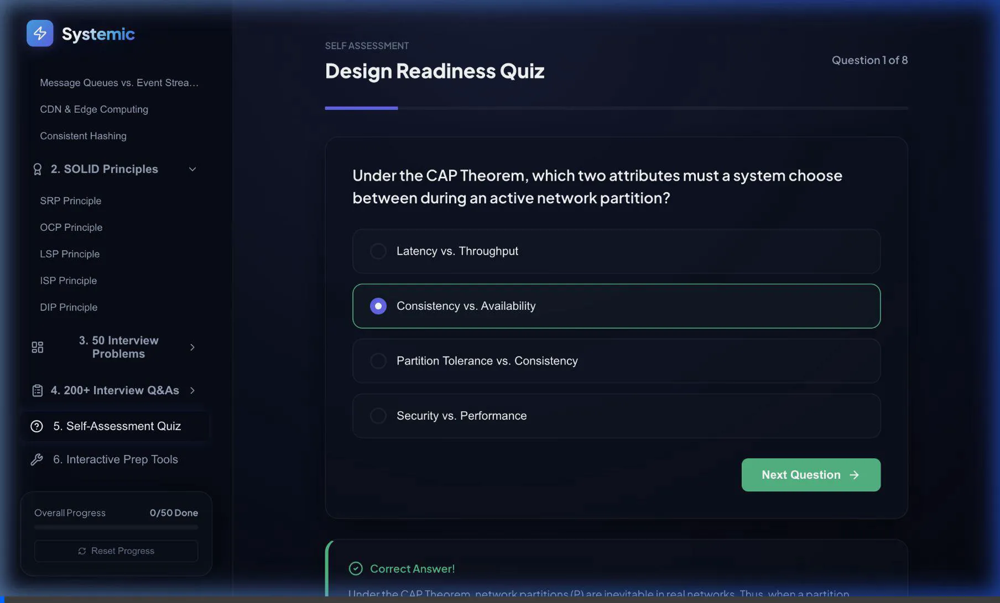
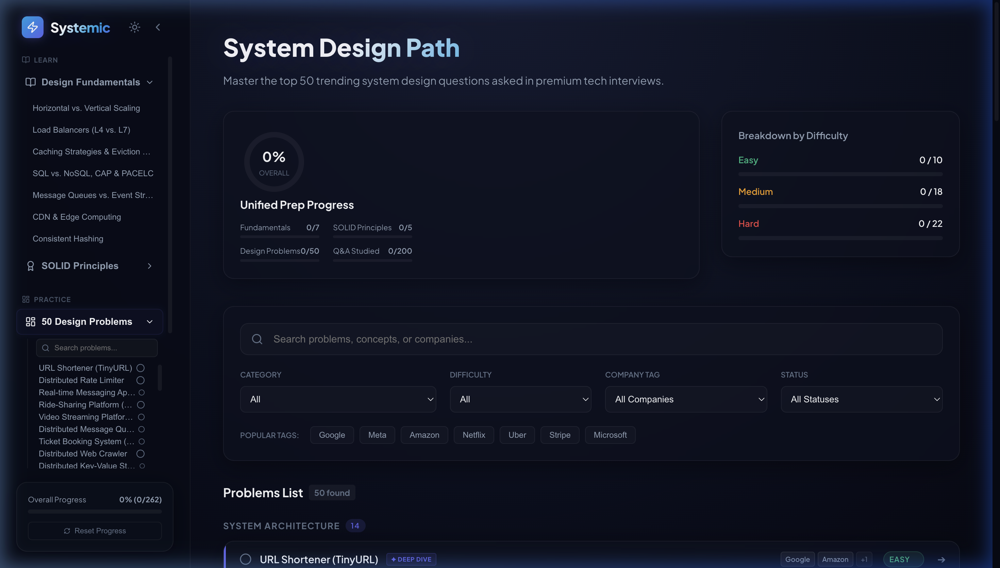
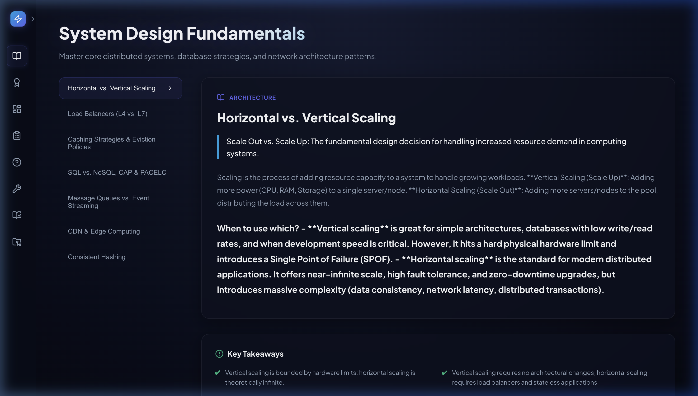
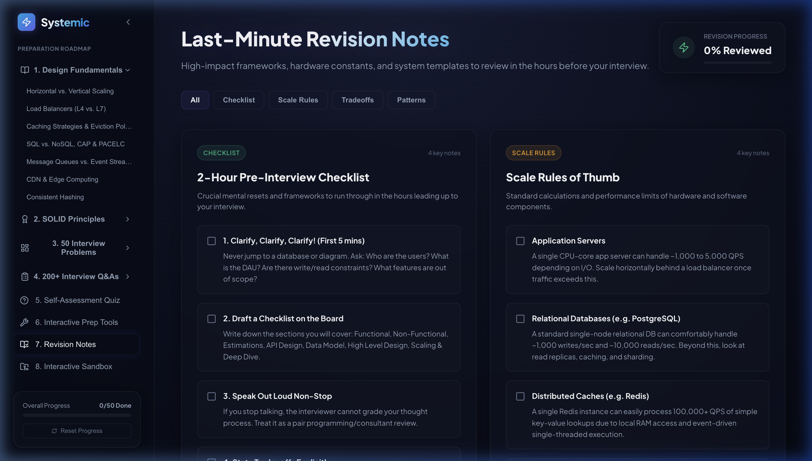
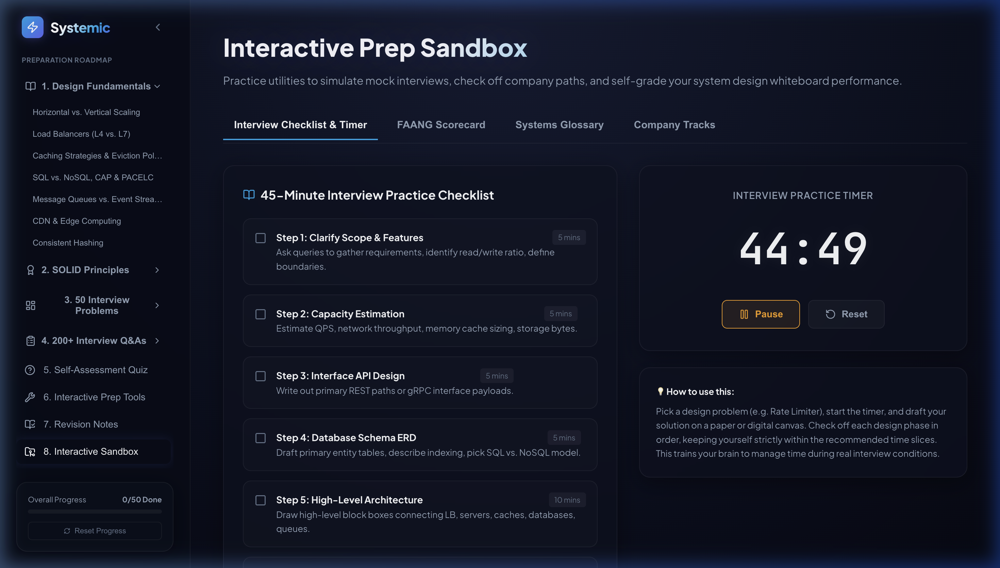
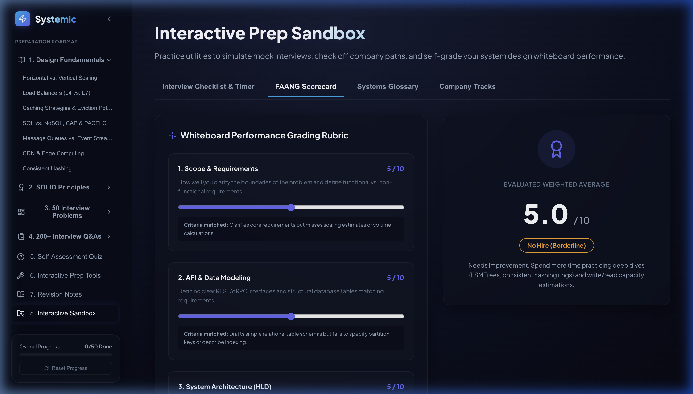

# 🚀 Systemic — Interactive System Design & SOLID Prep Platform

Systemic is a premium, feature-rich interactive web application designed to serve as a **single source of preparation** for System Design and LLD (Low-Level Design) interviews. It provides a structured learning roadmap, detailed conceptual breakdowns, interactive diagrams, and product design tools.

---

## 🖥️ Platform Demonstration

Below is a live walkthrough demonstrating the interactive sidebar, problem-solving flows, and the real-time capacity calculator:



---

## ✨ Key Features

### 1. Collapsible Sidebar & Mobile Friendly Layout
- **Desktop Sidebar**: Toggle between a fully expanded details view (280px) and a collapsed icon-only navigation bar (76px) to maximize your diagramming and code workspace.
- **Mobile Responsive overlays**: The application scales down to mobile widths, providing a sliding drawer navigation menu powered by a top hamburger icon button. Grids automatically scale to single column layouts.
- **Visual Progress Ring & Reset**: Live LocalStorage progress tracking showing total completed status indicators.

### 2. Last-Minute Revision Notes
High-impact cheatsheets summarizing core content:
- **2-Hour Checklist**: Key mental models and checklists before walking into the interview loop (Scope, checklist, talk aloud).
- **Scale Rules of Thumb**: App server throughput thresholds, database limits, and QPS estimations quick charts.
- **Key Trade-offs Cheat Sheet**: Relational vs. NoSQL, WebSockets vs. SSE, and Pull vs. Push.

### 3. Interactive Prep Sandbox
- **FAANG Scorecard**: A self-assessment tool based on actual FAANG grading rubrics. Adjust sliders to evaluate your design and communication performance to check your hiring verdict.
- **Interactive Practice Checklist**: A structured 45-minute whiteboard simulator. Start/pause the built-in countdown timer and check off required design phases (Requirements, Estimations, API, ERD, HLD, LLD, Tradeoffs).
- **Systems Glossary**: A searchable distributed systems dictionary with definitions for Gossip Protocol, Split-Brain, and Quorums.
- **Company Study Paths**: Specific problem paths tracked for Google, Meta, Uber, Netflix, and Amazon.

### 4. Back-of-the-Envelope Capacity Estimator
An interactive calculator where candidates can input system parameters (e.g. DAU, request frequency, write ratio, payload size, retention period) and instantly calculate:
- **Read & Write QPS** (Average & Peak).
- **Storage Sizing** (Daily, Yearly, and total retention).
- **Network Bandwidth** (Upload/Download in Mbps/Gbps).
- **Cache Memory Sizing** (using Pareto 80/20 rule).

### 5. Latency Numbers Comparator & Logarithmic Timeline
An interactive grid of Jeff Dean's famous numbers every programmer should know, complete with:
- **Logarithmic Timeline Bar**: Visually see operation speeds (L1 cache vs. Disk seek) on a colored logarithmic bar chart.
- **Comparison Sandbox**: Select two operations to compute relative scaling and human-time analogies (e.g. disk seek is 20M times slower than L1 cache, equivalent to 231 days if L1 lookup was 1 second).

---

## 📸 Application Screenshots

### Premium Main Dashboard
A clean glassmorphic UI tracking progress across all 50 system design problems:


### Collapsible Sidebar (Collapsed State)
Maximize your workspace with a neat icon-only toolbar:


### Last-Minute Revision Notes
Quickly review and check off core conceptual summaries:


### Whiteboard Timer & Practice Checklist
Time-slice your mock practice sessions:


### FAANG Grading Scorecard
Self-evaluate your design and communication loop:


---

## 🛠️ Technology Stack
- **Framework**: React + TypeScript + Vite
- **Styling**: Vanilla CSS (Custom Glassmorphism tokens, CSS Variables, and SVG animations)
- **Icons**: Lucide React
- **State Management**: Persistence enabled via LocalStorage (`sys_design_progress`)

---

## 🚀 Local Installation

Get the application running locally in under a minute:

1. **Clone the repository**:
   ```bash
   git clone git@github.com:yashdhingra0/system-design.git
   cd system-design
   ```

2. **Install dependencies**:
   ```bash
   npm install
   ```

3. **Start the development server**:
   ```bash
   npm run dev
   ```

4. Open `http://localhost:5173/` in your browser.
