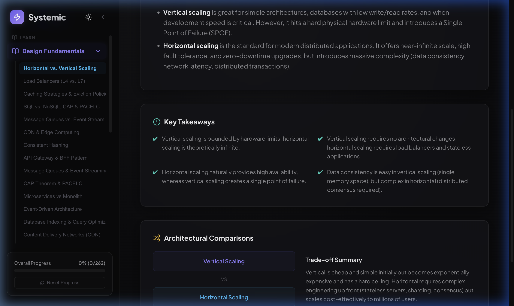
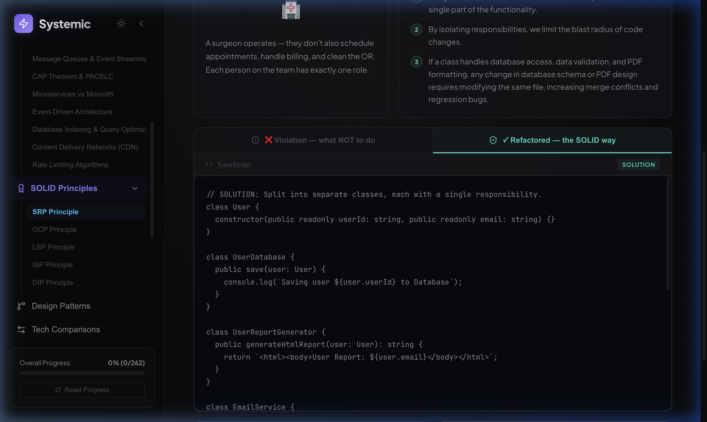
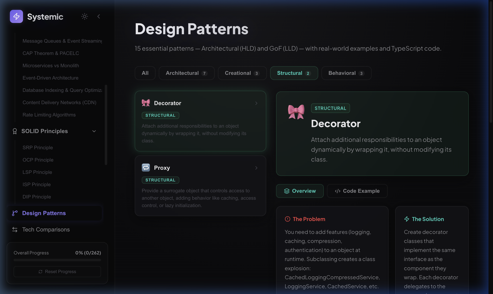
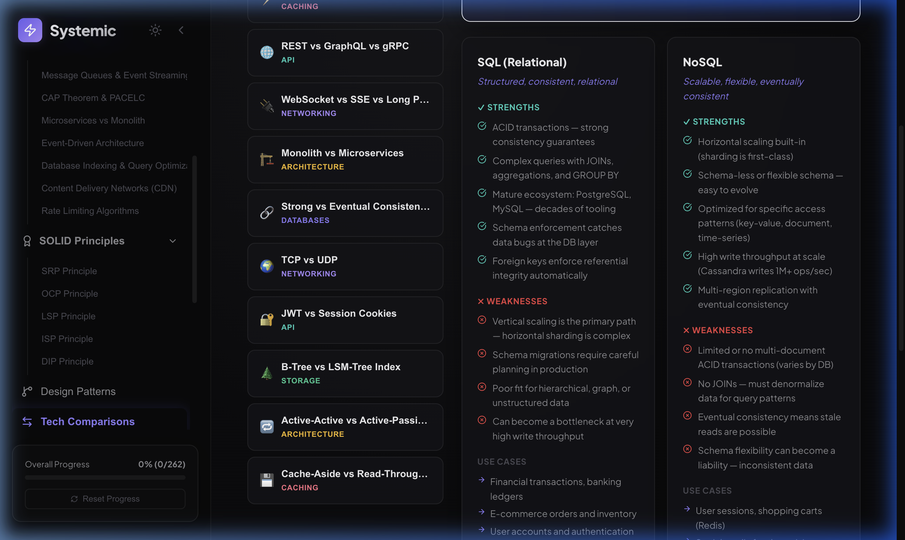

# 🚀 Systemic — Interactive System Design & SOLID Interview Prep

**Systemic** is a premium, feature-rich interactive web application built as a **single source of preparation** for System Design and LLD (Low-Level Design) interviews. It bundles a structured learning roadmap, conceptual deep-dives, interactive architecture diagrams, OOP design pattern walkthroughs, head-to-head tech comparisons, and product-ready prep tools — all in one sleek, dark-mode-first interface.

---

## 🖥️ Platform Walkthrough

A live demo recording showing the sidebar navigation, design fundamentals, LLD problems, Design Patterns, Tech Comparisons, and the Prep Tools in action:


---

## ✨ Feature Overview

### 1. 📚 Design Fundamentals
In-depth structured notes covering the foundational concepts every engineer must know for system design interviews:

- **Horizontal vs. Vertical Scaling**, Load Balancers (L4 vs. L7), Caching Strategies & Eviction Policies
- **SQL vs. NoSQL, CAP & PACELC**, Message Queues vs. Event Streaming, CDN & Edge Computing
- **Consistent Hashing**, API Gateway & BFF Pattern, Rate Limiting Algorithms
- **Database Indexing & Query Optimization**, Microservices vs. Monolith, Event-Driven Architecture



---

### 2. 🏆 SOLID Principles (Interactive)
An interactive, step-by-step walkthrough of all five SOLID Object-Oriented Design principles with:

- **Side-by-side Violation vs. Refactored code tabs** in TypeScript
- Real-world analogies for each principle (surgeons, plugins, shapes)
- Completion tracking with checkmarks persisted to LocalStorage



---

### 3. 🌿 Design Patterns (NEW)
15 essential GoF and Architectural patterns, grouped by category, with real-world context and TypeScript implementations:

- **Architectural (7)**: Repository, CQRS, Event Sourcing, Circuit Breaker, Saga, Strangler Fig, Sidecar
- **Creational (3)**: Singleton, Factory Method, Builder
- **Structural (2)**: Decorator, Proxy
- **Behavioral (3)**: Observer, Strategy, Command

Each pattern shows: Problem, Solution, TypeScript code example, and real-world production use cases.



---

### 4. ⚖️ Tech Comparisons (NEW)
A comprehensive comparison library for key technical trade-off decisions, featuring side-by-side strength/weakness matrices:

- **SQL vs. NoSQL**, REST vs. GraphQL vs. gRPC, WebSocket vs. SSE vs. Long Polling
- **Monolith vs. Microservices**, Strong vs. Eventual Consistency, TCP vs. UDP
- **JWT vs. Session Cookies**, B-Tree vs. LSM-Tree Index, Active-Active vs. Active-Passive
- **Cache-Aside vs. Read-Through**, Push vs. Pull Delivery, and more



---

### 5. 💻 50 System Design Problems — High-Density Catalog
The core practice catalog featuring 50 top system design problems, organized in a high-density, professional row-based layout:

- **Unified Prep Progress Dashboard**: Circular progress ring + breakdown by difficulty (Easy/Medium/Hard) + cross-category stats
- **Category-Grouped Problems List**: Problems grouped by domain (System Architecture, Distributed Systems, Low-Level Design, etc.)
- **Rich Filter Bar**: Search by keyword, filter by Category, Difficulty, Company Tag, and Status
- **Company Tags**: Google, Meta, Amazon, Netflix, Uber, Stripe, Microsoft
- **Deep Dive Badge**: Problems with full OOP implementations show a `✦ Deep Dive` badge


---

### 6. 🔬 Low-Level Design (LLD) — Deep Dive Problems
Three fully implemented, production-quality LLD problems with complete OOP code in **5 languages** (TypeScript, Python, Java, Go, C++):

#### Parking Lot System
Multi-level parking with O(1) spot allocation, vehicle type bucketing, a Singleton lot controller, O(1) unpark via plate map, and fine-grained mutex locking.


#### Vending Machine System
State Machine design pattern with `Idle → ItemSelected → HasMoney → Dispensing` transitions, coin denomination management, refund logic, and inventory control.


#### Elevator Dispatch System
Group controller implementing the SCAN scheduling algorithm with separate up/down sorted sets, nearest-compatible elevator selection, and configurable floor range support.


---

### 7. 🗂️ Categorized Sidebar Navigation Tree
A collapsible, structured navigation sidebar with grouped sections:

- **Expandable Categories**: Design Fundamentals, SOLID Principles, 50 Design Problems, 200+ Q&As — each with a collapsible accordion
- **Inline Status & Difficulty Tags**: Color-coded `E/M/H` difficulty pills and completion icons (✓/▷/○) directly in the sidebar
- **Problem Search**: Instant search bar inside the problems accordion
- **Desktop Collapse Mode**: Sidebar folds to icon-only mode (76px) with a single toggle
- **Mobile Drawer**: GPU-accelerated slide-in overlay on mobile with backdrop blur


---

### 8. 📖 200+ System Design Q&As
A categorized deck of over 200 interview-level questions across all distributed systems topics. Features:

- Category-grouped accordion view with search
- Individual question detail view with flip-card reveal pattern
- Completion tracking and Bloom-filter style tag filter

---

### 9. 🛠️ Prep Tools
Interactive calculators and reference tools for interview day:

- **Back-of-the-Envelope Calculator**: Input DAU, request freq, write ratio, payload, retention — get instant QPS, Storage, Bandwidth, and Cache estimates
- **Latency Numbers Comparator**: Jeff Dean's famous latency numbers on a logarithmic timeline bar with relative comparison sandbox (e.g. "Disk seek is 20M× slower than L1 cache")

---

### 10. 📋 Prep Sandbox
A set of interview preparation utilities:

- **FAANG Grading Scorecard**: Slider-based self-assessment using real FAANG grading rubrics — get an instant hiring verdict
- **Whiteboard Practice Timer**: A 45-minute structured mock session with a countdown timer and a phase checklist (Requirements → Estimations → API → ERD → HLD → LLD → Tradeoffs)
- **Systems Glossary**: Searchable distributed systems dictionary (Gossip Protocol, Split-Brain, Quorum, etc.)
- **Company Study Paths**: Curated problem tracks for Google, Meta, Uber, Netflix, and Amazon

---

### 11. 📝 Revision Notes
High-signal, last-minute cheatsheets:

- **2-Hour Checklist**: Key mental models and decision frameworks for the interview loop
- **Scale Rules of Thumb**: App server throughput thresholds, DB limits, QPS estimation charts
- **Trade-offs Cheat Sheet**: Relational vs. NoSQL, WebSockets vs. SSE, Pull vs. Push

---

### 12. 🌗 Dark / Light Mode
Full dark and light theme support with `localStorage` persistence. Toggle is available in both the expanded sidebar header and the collapsed icon bar.

---

## 📸 Additional Screenshots

| View | Preview |
|---|---|
| Design Fundamentals |  |
| SOLID Principles |  |
| Design Patterns |  |
| Tech Comparisons |  |
| Sidebar Tree |  |
| Dashboard |  |
| Parking Lot LLD |  |
| Vending Machine LLD |  |
| Elevator LLD |  |

---

## 🛠️ Technology Stack

| Layer | Technology |
|---|---|
| Framework | React 18 + TypeScript + Vite |
| Styling | Vanilla CSS — Glassmorphism design system, CSS variables, SVG animations |
| Icons | Lucide React |
| Analytics | Vercel Analytics |
| State | LocalStorage persistence (`sys_design_progress`, `sys_design_theme`) |

---

## 🚀 Quick Start

```bash
# 1. Clone the repo
git clone git@github.com:yashdhingra0/system-design.git
cd system-design

# 2. Install dependencies
npm install

# 3. Start the dev server
npm run dev
```

Open **http://localhost:5173/** in your browser.

---

## 📁 Project Structure

```
src/
├── App.tsx                    # Root layout, sidebar, routing
├── index.css                  # Full design system (glassmorphism, tokens, responsive)
├── components/
│   ├── Dashboard.tsx          # 50 problems catalog with filtering & progress
│   ├── ConceptDetail.tsx      # Design Fundamentals viewer
│   ├── SolidPrinciples.tsx    # SOLID principles interactive viewer
│   ├── DesignPatterns.tsx     # Design Patterns catalog & detail
│   ├── TechComparisons.tsx    # Technology comparison matrices
│   ├── SystemDiagrams.tsx     # Interactive SVG architecture diagrams
│   ├── SystemEvolution.tsx    # System evolution timeline viewer
│   ├── ProblemDetail.tsx      # Individual LLD problem detail view
│   ├── QuestionsDeck.tsx      # 200+ Q&A deck with categories
│   ├── Quiz.tsx               # Self-assessment quiz
│   ├── PrepTools.tsx          # Capacity calculators & latency tools
│   ├── RevisionNotesView.tsx  # Last-minute revision cheatsheets
│   └── PrepSandbox.tsx        # FAANG scorecard, timer, glossary
└── data/
    ├── problems.ts            # 50 system design problem definitions
    ├── concepts.ts            # Design fundamentals content
    ├── solidData.ts           # SOLID principles + code examples
    ├── designPatterns.ts      # 15 GoF & architectural patterns
    ├── techComparisons.ts     # Tech comparison matrices
    ├── systemEvolutions.ts    # System evolution data
    └── interviewQuestions.ts  # 200+ interview Q&As
```
