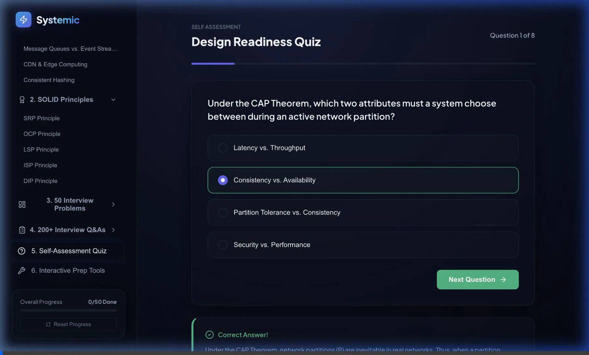
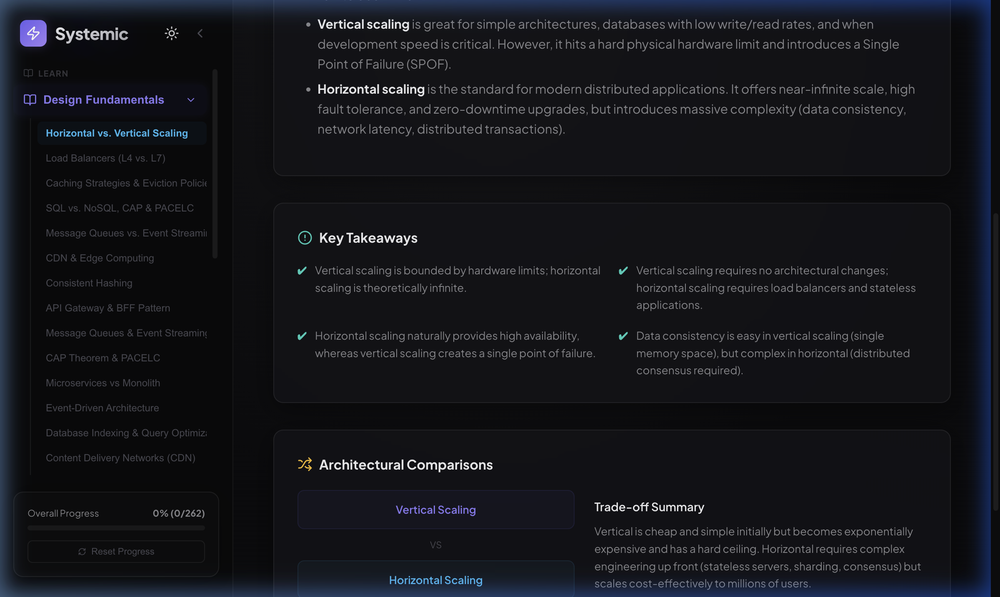
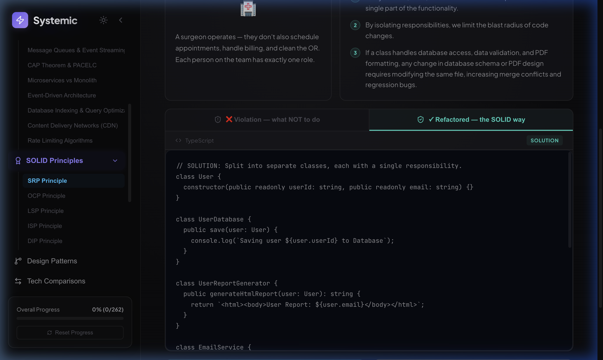
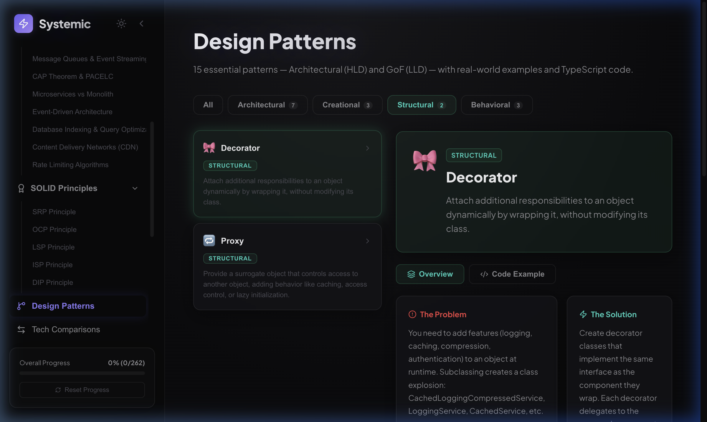
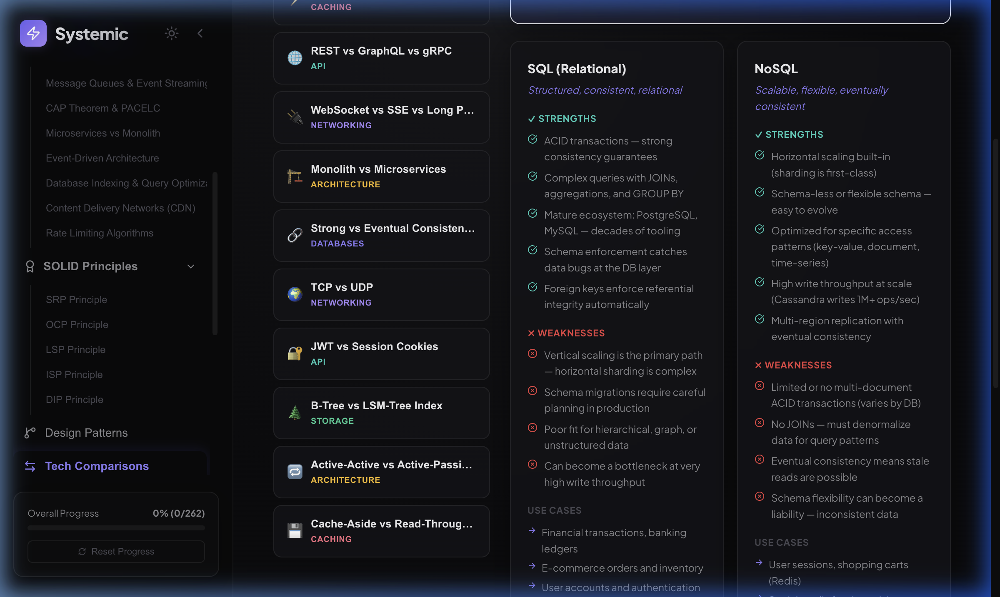
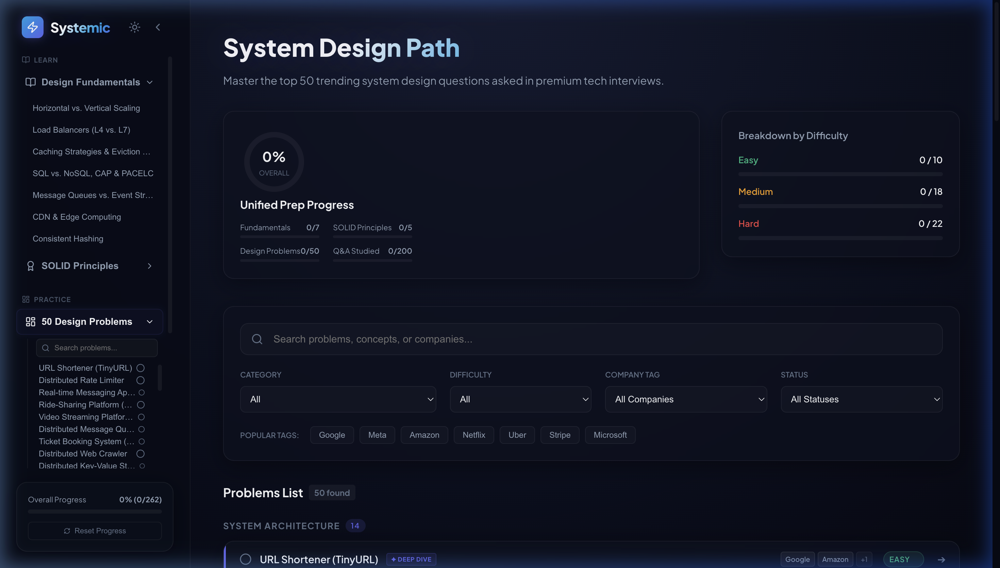
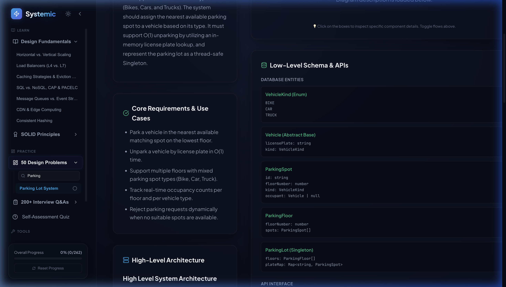
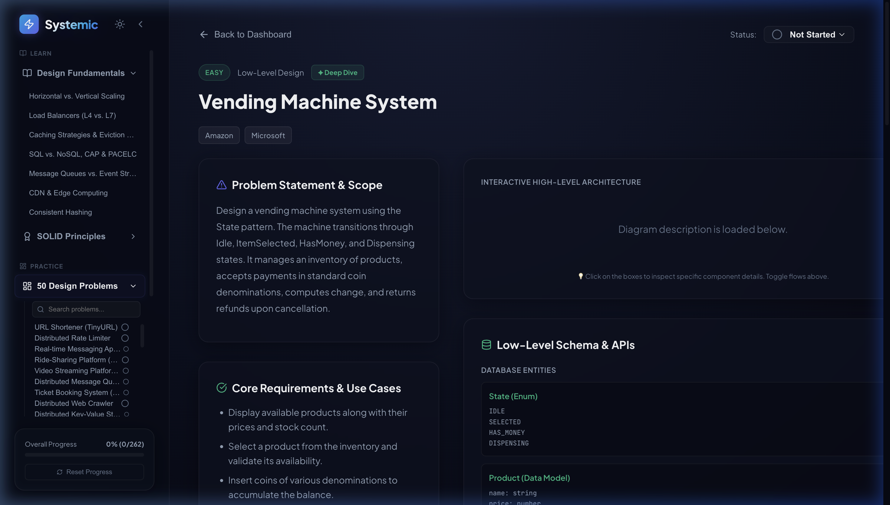
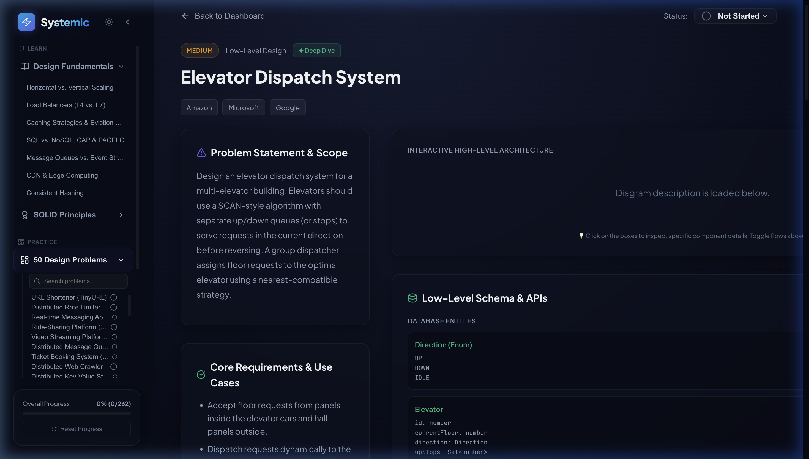

# 🚀 Systemic — Interactive System Design & SOLID Interview Prep

**Systemic** is a premium, feature-rich interactive web application built as a **single source of preparation** for System Design and LLD (Low-Level Design) interviews. It bundles a structured learning roadmap, conceptual deep-dives, interactive architecture diagrams, OOP design pattern walkthroughs, head-to-head tech comparisons, and product-ready prep tools — all in one sleek, dark-mode-first interface.

---

## 🖥️ Platform Walkthrough

A live demo recording showing the sidebar navigation, design fundamentals, LLD problems, Design Patterns, Tech Comparisons, and the Prep Tools in action:



---

## ✨ Feature Overview

### 1. 📚 Design Fundamentals (Core Concepts)
In-depth structured notes covering the foundational concepts every engineer must know for system design interviews:

- **Horizontal vs. Vertical Scaling**, Load Balancers (L4 vs. L7), Caching Strategies & Eviction Policies
- **SQL vs. NoSQL, CAP & PACELC**, Message Queues vs. Event Streaming, CDN & Edge Computing
- **Consistent Hashing**, API Gateway & BFF Pattern, Rate Limiting Algorithms
- **Database Indexing & Query Optimization**, Microservices vs. Monolith, Event-Driven Architecture



---

### 2. 🏆 SOLID Principles (Interactive)
An interactive, step-by-step walkthrough of all five SOLID Object-Oriented Design principles with:

- **Side-by-side Violation vs. Refactored code tabs** in TypeScript
- Real-world analogies for each principle (surgeons, plugins, shapes)
- Completion tracking with checkmarks persisted to LocalStorage



---

### 3. 🌿 Design Patterns
15 essential GoF and Architectural patterns, grouped by category, with real-world context and TypeScript implementations:

- **Architectural (7)**: Repository, CQRS, Event Sourcing, Circuit Breaker, Saga, Strangler Fig, Sidecar
- **Creational (3)**: Singleton, Factory Method, Builder
- **Structural (2)**: Decorator, Proxy
- **Behavioral (3)**: Observer, Strategy, Command

Each pattern shows: Problem, Solution, TypeScript code example, and real-world production use cases.



---

### 4. ⚖️ Tech Comparisons
A comprehensive comparison library for key technical trade-off decisions, featuring side-by-side strength/weakness matrices:

- **SQL vs. NoSQL**, REST vs. GraphQL vs. gRPC, WebSocket vs. SSE vs. Long Polling
- **Monolith vs. Microservices**, Strong vs. Eventual Consistency, TCP vs. UDP
- **JWT vs. Session Cookies**, B-Tree vs. LSM-Tree Index, Active-Active vs. Active-Passive
- **Cache-Aside vs. Read-Through**, Push vs. Pull Delivery, and more



---

### 5. 🤖 Agentic AI Developer Roadmap (NEW)
A comprehensive, interactive 5-phase developer curriculum designed to take you from foundational AI concepts to advanced, autonomous multi-agent systems:

- **Interactive Phases**: Basic LLM API usage, prompt engineering, RAG pipelines, agent loops, and production multi-agent architectures
- **Progress Tracking**: Phase-by-phase completion progress bars with localStorage persistence

---

### 6. 🎓 AI Learning Hub (NEW)
A deep-dive, topic-by-topic training center with interactive guides:
- Complete markdown notes explaining memory architectures, agent tools, and guardrails
- **Copyable Code Blocks**: TypeScript-based code snippets representing core AI pipeline configurations
- Structured checklists and highlights (Tips & Warnings) for building production-grade agentic workflows

---

### 7. 📡 Live AI & Tech News Feed (NEW)
A real-time tech and AI news panel keeping you up to date on the industry's latest developments:
- **News Ticker**: Integrated, auto-rotating compact headline ticker in the top navbar
- **News Sidebar Panel**: Sticky right-side panel present across all core pages for live tracking
- **Full News Reader**: Full-tab feed with inline article viewing, category filters, and built-in local development proxy detection

---

### 8. 💻 50 System Design Problems — High-Density Catalog
The core practice catalog featuring 50 top system design problems, organized in a high-density, professional row-based layout:

- **Unified Prep Progress Dashboard**: Circular progress ring + breakdown by difficulty (Easy/Medium/Hard) + cross-category stats
- **Category-Grouped Problems List**: Problems grouped by domain (System Architecture, Distributed Systems, Low-Level Design, etc.)
- **Rich Filter Bar**: Search by keyword, filter by Category, Difficulty, Company Tag, and Status
- **Company Tags**: Google, Meta, Amazon, Netflix, Uber, Stripe, Microsoft
- **Deep Dive Badge**: Problems with full OOP implementations show a `✦ Deep Dive` badge



---

### 9. 🔬 Low-Level Design (LLD) — Deep Dive Problems
Three fully implemented, production-quality LLD problems with complete OOP code in **5 languages** (TypeScript, Python, Java, Go, C++):

#### Parking Lot System
Multi-level parking with O(1) spot allocation, vehicle type bucketing, a Singleton lot controller, O(1) unpark via plate map, and fine-grained mutex locking.



#### Vending Machine System
State Machine design pattern with `Idle → ItemSelected → HasMoney → Dispensing` transitions, coin denomination management, refund logic, and inventory control.



#### Elevator Dispatch System
Group controller implementing the SCAN scheduling algorithm with separate up/down sorted sets, nearest-compatible elevator selection, and configurable floor range support.



---

### 10. 🌐 Interactive System Diagrams (NEW)
Highly detailed, interactive architectural diagrams of real-world global systems:
- **Systems Included**: YouTube, Twitter/X, Discord, Uber, Netflix, Instagram
- **Deep Insights**: Key scaling breakthroughs, bottlenecks, and detailed data storage hierarchies
- **Interactive Tech Stacks**: Clickable components displaying custom descriptions of the technology choices used in production

---

### 11. 📈 System Evolution Timelines (NEW)
A visual timeline highlighting how architecture, tech stacks, and scale constraints evolved over time at hyper-growth tech giants:
- Detailed stages describing initial MVP setup, mid-scale re-architecting, and global-scale microservice patterns
- Visual progress path showcasing timeline milestones, key user stats, and architectural pivots

---

### 12. 🩺 Design Doctor (NEW)
An interactive architectural diagnostic tool helping you match system requirements and bottlenecks to target design patterns:
- **Symptom Checklist**: Check off issues like "slow database queries", "write congestion", "high global latency", or "fragile cascade failures"
- **Pattern Prescription**: Get real-time recommendations scoring the most relevant GoF or architectural patterns
- **Contextual Explanations**: Side-by-side analysis of *why* each pattern fits your diagnostic query

---

### 13. 📖 200+ System Design Q&As
A categorized deck of over 200 interview-level questions across all distributed systems topics. Features:

- Category-grouped accordion view with search
- Individual question detail view with flip-card reveal pattern
- Completion tracking and Bloom-filter style tag filter

---

### 14. ⚡ Self-Assessment Quiz (NEW)
An interactive, multiple-choice quiz system containing custom questions designed to test your knowledge of scale estimation, CAP theorem, load balancers, caching, and LLD.

---

### 15. 🛠️ Prep Tools
Interactive calculators and reference tools for interview day:

- **Back-of-the-Envelope Calculator**: Input DAU, request freq, write ratio, payload, retention — get instant QPS, Storage, Bandwidth, and Cache estimates
- **Latency Numbers Comparator**: Jeff Dean's famous latency numbers on a logarithmic timeline bar with relative comparison sandbox (e.g. "Disk seek is 20M× slower than L1 cache")

---

### 16. 📋 Prep Sandbox
A set of interview preparation utilities:

- **FAANG Grading Scorecard**: Slider-based self-assessment using real FAANG grading rubrics — get an instant hiring verdict
- **Whiteboard Practice Timer**: A 45-minute structured mock session with a countdown timer and a phase checklist (Requirements → Estimations → API → ERD → HLD → LLD → Tradeoffs)
- **Systems Glossary**: Searchable distributed systems dictionary (Gossip Protocol, Split-Brain, Quorum, etc.)
- **Company Study Paths**: Curated problem tracks for Google, Meta, Uber, Netflix, and Amazon

---

### 17. 📝 Revision Notes
High-signal, last-minute cheatsheets:

- **2-Hour Checklist**: Key mental models and decision frameworks for the interview loop
- **Scale Rules of Thumb**: App server throughput thresholds, DB limits, QPS estimation charts
- **Trade-offs Cheat Sheet**: Relational vs. NoSQL, WebSockets vs. SSE, Pull vs. Push

---

### 18. 🌗 Dark / Light Mode
Full dark and light theme support with `localStorage` persistence. Toggle is available in both the expanded sidebar header and the collapsed icon bar.

---

## 🛠️ Technology Stack

| Layer | Technology |
|---|---|
| Framework | React 18 + TypeScript + Vite |
| Styling | Vanilla CSS — Emerald theme, Glassmorphism elements, CSS variables, SVG animations |
| Icons | Lucide React |
| Analytics | Vercel Analytics |
| State | LocalStorage persistence (`sys_design_progress`, `sys_design_theme`, `ai-completed`) |

---

## 🚀 Quick Start

```bash
# 1. Clone the repo
git clone git@github.com:yashdhingra0/system-design.git
cd system-design

# 2. Install dependencies
npm install

# 3. Start the dev server
npm run dev
```

Open **http://localhost:5173/** in your browser.

---

## 📁 Project Structure

```
src/
├── App.tsx                    # Root layout, router, progress state, global theme
├── index.css                  # Core design system (emerald theme, glassmorphism, responsive)
├── main.tsx                   # App mounting point
├── components/
│   ├── TopNavbar.tsx          # Fixed top header, search, live news ticker, and theme switcher
│   ├── LeftSidebar.tsx        # Collapsible multi-group sidebar navigation (76px / 220px)
│   ├── Dashboard.tsx          # 50 problems catalog with filtering, search, and progress dashboard
│   ├── ConceptDetail.tsx      # Interactive Design Fundamentals study notes
│   ├── SolidPrinciples.tsx    # SOLID principles interactive violation/refactor tabs
│   ├── DesignPatterns.tsx     # 15 GoF & Architectural design patterns reference catalog
│   ├── TechComparisons.tsx    # Technology comparison matrices (SQL vs NoSQL, REST/gRPC/GraphQL)
│   ├── AIRoadmap.tsx          # Interactive Agentic AI Developer Roadmap timeline
│   ├── AILearningHub.tsx      # Detailed AI curriculum guides, code blocks, tips, and checklists
│   ├── AINewsFeed.tsx         # Live tech/AI news feed reader and compact side panel
│   ├── SystemDiagrams.tsx     # Interactive SVG system design diagrams (YouTube, Twitter, Discord, etc.)
│   ├── SystemEvolution.tsx    # Interactive architectural scaling timelines (Slack, Twitter, Netflix)
│   ├── DesignDoctor.tsx       # System symptom diagnostics checklist & pattern recommendations
│   ├── ProblemDetail.tsx      # LLD problem details with multi-language code tabs (TS/Py/Java/Go/C++)
│   ├── QuestionsDeck.tsx      # 200+ flip-card Q&As with search and categories
│   ├── Quiz.tsx               # Interactive self-assessment quiz system
│   ├── PrepTools.tsx          # Latency comparator timeline and back-of-the-envelope estimator
│   ├── PrepSandbox.tsx        # FAANG interview scorecard, whiteboard mock timer, systems glossary
│   └── RevisionNotesView.tsx  # Last-minute scale formulas, trade-offs, and revision checklist
└── data/
    ├── aiCurriculum.ts        # Agentic AI curriculum guidelines and content
    ├── concepts.ts            # Design fundamentals structured notes
    ├── solidData.ts           # SOLID principles analogies & TypeScript examples
    ├── designPatterns.ts      # 15 GoF and architectural patterns content
    ├── techComparisons.ts     # Trade-off comparison matrix data
    ├── systemEvolutions.ts    # Company-specific architectural scaling stages
    ├── interviewQuestions.ts  # 200+ interview Q&As definitions
    ├── revisionNotes.ts       # Revision charts, scale limits, and rules of thumb
    ├── sandboxData.ts         # Glossary definitions and company pathways
    └── problems/              # Individual LLD problem metadata & code databases
        ├── chatService.ts
        ├── elevatorSystem.ts
        ├── messageQueue.ts
        ├── parkingLot.ts
        ├── rateLimiter.ts
        ├── rideSharing.ts
        ├── ticketBooking.ts
        ├── urlShortener.ts
        ├── vendingMachine.ts
        ├── videoStreaming.ts
        ├── webCrawler.ts
        └── index.ts           # Aggregated problems registry
```
